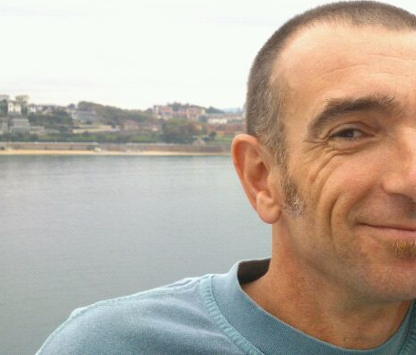

```{=html}
<div class="crumbs"><a href="../index.html">igartua</a> / about</div>
<article class="page-article">
<div class="thesis-hero" style="display:grid;grid-template-columns:200px 1fr;gap:32px;align-items:start;margin:0 0 32px;padding:24px;background:var(--tint);border:1px solid var(--line)">
  <figure class="thesis-portrait" style="margin:0"></figure>
  <div class="thesis-facts" style="margin:0;padding:0;background:none;border:0">
    <div class="row"><div class="k">Name</div><div class="v">Josu Mirena Igartua Aldamiz</div></div>
    <div class="row"><div class="k">Position</div><div class="v">Full Professor of Physics (Catedrático de Universidad), since 2020</div></div>
    <div class="row"><div class="k">Department</div><div class="v">Physics Department, Faculty of Science and Technology, UPV/EHU, Leioa</div></div>
    <div class="row"><div class="k">Area</div><div class="v">Applied Physics &middot; Thermodynamics and statistical physics</div></div>
    <div class="row"><div class="k">Group</div><div class="v">Thermomat / HAIRL, thermophysical properties of materials</div></div>
    <div class="row"><div class="k">Languages</div><div class="v">Basque, Spanish, English; teaching in Basque since 1993</div></div>
    <div class="row"><div class="k">Contact</div><div class="v"><a href="mailto:josu.igartua@ehu.eus">josu.igartua@ehu.eus</a> &middot; <a href="https://orcid.org/0000-0001-7983-5331">ORCID 0000-0001-7983-5331</a></div></div>
  </div>
</div>
<h1>Career</h1>
<p class="sub">Thirty-four years at the University of the Basque Country, in the same faculty and, since 2011, the same course.</p>
```

I studied physics at the University of the Basque Country and obtained my doctorate in solid-state physics there in 1994, on the crystallography of perovskite-type oxides. I joined the teaching staff in 1992, first at the industrial engineering school in Bilbao and then at the Faculty of Science and Technology in Leioa, became a tenured associate professor (Profesor Titular) in 1997, and was appointed Full Professor of Physics in 2020, in the area of Applied Physics with the profile of thermodynamics and statistical physics, bilingual Basque and Spanish.

For most of that time my research was the structural physics of solids: crystal structures and phase transitions in simple and double perovskites, studied with powder diffraction, Raman spectroscopy and symmetry-mode analysis, with experiments at the Institut Laue-Langevin, the ESRF and the Paul Scherrer Institute. Around 2018 I moved into the Thermomat group, which measures and models the thermal radiative properties of materials, and I am one of its two principal investigators. Since 2011 my teaching has been one course, Termodinamika eta Fisika Estatistikoa, and the bachelor's theses that grow out of it.

## Timeline

```{=html}
<table>
<thead><tr><th>Years</th><th>Position</th><th>Where</th></tr></thead>
<tbody>
<tr><td>1989–1992</td><td>Doctoral fellow, Basque Government</td><td>UPV/EHU</td></tr>
<tr><td>1992–1993</td><td>Lecturer (Profesor Titular de Escuela Universitaria, interim; then Profesor Asociado)</td><td>Industrial Engineering School, Bilbao, and Faculty of Science and Technology, Leioa</td></tr>
<tr><td>1993–1995</td><td>Associate lecturer, bilingual</td><td>Faculty of Science and Technology, Leioa</td></tr>
<tr><td>1994</td><td>PhD in Solid State Physics</td><td>UPV/EHU</td></tr>
<tr><td>1995–1997</td><td>Profesor Titular de Universidad, interim</td><td>Applied Physics II</td></tr>
<tr><td>1997–2020</td><td>Profesor Titular de Universidad, tenured</td><td>Applied Physics II</td></tr>
<tr><td>2012–2015</td><td>Vice-Dean for Students and Academic Exchange</td><td>Faculty of Science and Technology</td></tr>
<tr><td>2020–</td><td>Full Professor of Physics (Catedrático de Universidad)</td><td>Physics Department, UPV/EHU</td></tr>
</tbody>
</table>
```

## Recognition

- Five six-year research periods (sexenios) recognised, the latest starting in 2019, and five five-year teaching periods (quinquenios) as of 2020.
- Teaching evaluated twice under the DOCENTIAZ programme, both times in the top band ("Oso ongi"), with scores of 82.4 and 95.7 over the periods 2008–2013 and 2013–2018.
- Doctoral supervision: five theses, all with the highest grade, three with international mention, one with the extraordinary doctorate prize.
- Associate editor of *Energies* (MDPI); reviewer for *Journal of Solid State Chemistry*, *Materials Chemistry and Physics*, the *Physical Review* journals, *Journal of Alloys and Compounds* and *Zeitschrift für Kristallographie*, among others.
- Accredited to teach in English and in Basque; three courses taught at Université Moulay Ismaïl, Errachidia, Morocco.

## Elsewhere

- [ORCID 0000-0001-7983-5331](https://orcid.org/0000-0001-7983-5331)
- [Google Scholar](https://scholar.google.es/citations?user=nYJ--CkAAAAJ)
- [ResearchGate](https://www.researchgate.net/profile/Josu-Igartua)
- [UPV/EHU research portal](https://ekoizpen-zientifikoa.ehu.eus/investigadores/128210/detalle)
- [GitHub](https://github.com/jmigartua)

```{=html}
</article>
```
