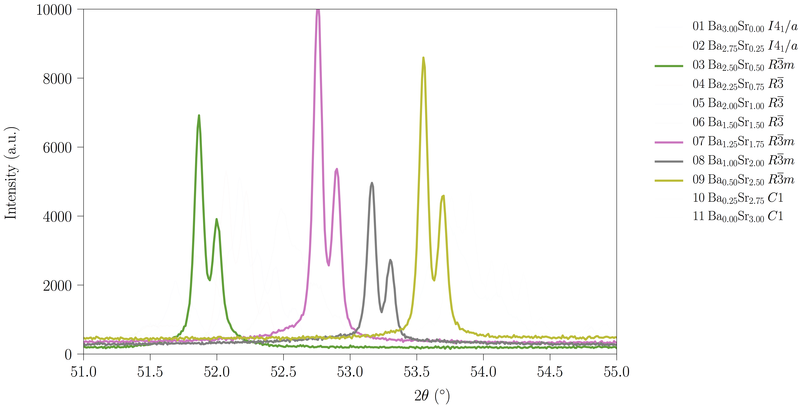

```{=html}
<section class="mission">
  <div class="wrap mission-grid">
    <div>
      <h1>Fisikaria naiz Euskal Herriko Unibertsitatean. <strong>Solidoen egitura, materialen erradiazio termikoa eta fisika nola irakasten den</strong> ditut lan-gai.</h1>
      <p class="who">Fisikako katedraduna Leioako Zientzia eta Teknologia Fakultatean, 1988tik bertako langile eta 1994tik doktore. Hogeita hamar urte difrakzioan, kalorimetrian eta perobskiten fase-trantsizioetan; hamarkada bat Thermomat taldean, nik ko-zuzentzen dudana, energiarako materialen emisibitate infragorria HAIRL erradiometroarekin neurtzen; eta, 2011tik urtero, termodinamikaren eta fisika estatistikoaren irakasgaia, euskaraz, bere koadernoekin, simulazioekin eta gradu amaierako lanekin.</p>
      <p class="quicklinks"><a href="research/index.html">Ikerketa-lerroak</a><span class="sep">&middot;</span><a href="publications/index.html">Argitalpenak</a><span class="sep">&middot;</span><a href="theses/index.html">Tesiak</a><span class="sep">&middot;</span><a href="teaching/index.html">Irakaskuntza</a><span class="sep">&middot;</span><a href="mailto:josu.igartua@ehu.eus">Harremana</a></p>
    </div>
    <figure class="spectrum">
      
      <figcaption>Hauts-difrakzioa Ba–Sr disoluzio solido batean zehar: hamaika konposizio, lau espazio-talde. Kristal baten simetria bere gailurrak non banatzen diren irakurtzea da nire egitura-lanaren haria. Irudia nire ikerketa-dokumentaziotik.</figcaption>
    </figure>
  </div>
</section>

<section class="featured-band">
  <div class="wrap featured-grid">
    <div>
      <div class="featured-kicker">Orain &middot; 2026&ndash;2027 ikasturtea</div>
      <h2 class="featured-title">Termodinamika eta fisika estatistikoa, euskaraz<span class="featured-sub">Termodinamika eta Fisika Estatistikoa &middot; 12 ECTS &middot; Fisikako Graduko hirugarren maila</span></h2>
      <p class="featured-body">2011&ndash;2012tik urtero ematen dudan irakasgaia, eta unibertsitate honetan euskarara ekarri nuen gaia, bere lehen material-multzo osoarekin: eguneroko klase-egunkaria, azterketatxoak, errubrika publikoa, Jupyter koadernoak euskaraz eta MinervaLab, gradu amaierako lan batetik sortutako lehen ordenako fase-trantsizioen simulazio-laborategia. Irakasgaitik ateratzen diren lanek, martxan daudenek eta datorren urterako proposamenek beren webgunea dute.</p>
      <p class="featured-links"><a href="teaching/index.html">Nola funtzionatzen duen irakasgaiak</a><span class="sep">&middot;</span><a href="https://jmigartua.github.io/tfgs-website/eu/proposals/">2026&ndash;2027 GrAL proposamenak</a><span class="sep">&middot;</span><a href="https://jmigartua.github.io/tfgs-website/eu/on-going/">Martxan dauden lanak</a><span class="sep">&middot;</span><a href="https://jmigartua.github.io/tfgs-website/eu/preparing/">Prestaketa eskuliburua</a></p>
    </div>
    <div class="featured-when">
      <div class="d">2011tik</div>
      <div class="l">Zientzia eta Teknologia Fakultatea, Leioa</div>
      <div class="c">46 gradu amaierako lan zuzenduak &middot; 2011&ndash;2026</div>
    </div>
  </div>
</section>

<section class="home-section" id="research">
  <div class="wrap">
    <div class="sec-head"><h2>Ikerketa</h2><a class="more" href="research/index.html">Hiru lerroak &rarr;</a></div>
    <p class="sec-intro">Materialen fisikako bi lerro, metodo bera partekatzen dutenak, simetria eta haren haustura esperimentutik irakurtzea, eta hirugarren lerro bat fisika nola ikasten den aztertzen duena, laborategian erabiltzen ditudan tresna konputazional berberekin.</p>
    <div class="lines">
      <div class="line-item"><div class="num">01</div><h3><a href="research/index.html#structure">Egitura eta fase-trantsizioak perobskitetan</a></h3><p>Perobskita sinple, bikoitz eta hirukoitzen eta kristal ferroikoen egitura kristalinoak eta fase-trantsizio estrukturalak, kalorimetria adiabatikoz, Raman eta infragorri espektroskopiaz, X izpien eta neutroien hauts-difrakzioz eta simetria-moduen analisiz. Laborategiko X izpien datuek sinkrotroi bat behar zuen lana egitea ahalbidetzen duen errefinamendu-protokolo parametrizatua.</p><div class="caps">moduen kristalografia &middot; AMPLIMODES &middot; ILL, ESRF, SINQ &middot; bost doktorego-tesi</div></div>
      <div class="line-item"><div class="num">02</div><h3><a href="research/index.html#radiation">Materialen propietate erradiatibo termikoak</a></h3><p>Thermomat / HAIRL taldean: zehaztasun handiko emisibitate espektral angeluarra espektro- eta tenperatura-tarte zabaletan, ziurgabetasun-aurrekontuak, emisometroaren tenperatura-kontrola, neurketen FAIR erregistroa eta EKHI datu-base irekia, kontzentrazio bidezko eguzki-energiarako, fusio-materialetarako, altzairu aurreraturako eta gainazal estalietarako.</p><div class="caps">HAIRL erradiometroa &middot; EKHI &middot; fer esparrua &middot; bi doktorego-tesi martxan</div></div>
      <div class="line-item"><div class="num">03</div><h3><a href="research/index.html#teaching">Konputazioa fisikaren irakaskuntzan</a></h3><p>Jupyter koadernoak irakasgai teoriko baten laborategi-koaderno gisa, MinervaLab fase-trantsizioetarako, irakas-materialak euskaraz, eta ikasleek benetan nola errenditzen duten aztertzea: irakasgaiaren beraren datuetatik fisikako sarbide-azterketara Espainia osoan.</p><div class="caps">CSEDU, GIREP, RSEF &middot; MinervaLab &middot; PAU Fisika</div></div>
    </div>
  </div>
</section>

<section class="home-section tinted" id="publications">
  <div class="wrap">
    <div class="sec-head"><h2>Azken argitalpenak</h2><a class="more" href="publications/index.html">Zerrenda osoa &rarr;</a></div>
```





```{=html}
  </div>
</section>

<section class="home-section" id="theses">
  <div class="wrap">
    <div class="sec-head"><h2>Tesiak</h2><a class="more" href="theses/index.html">Zuzendutako tesiak &rarr;</a></div>
    <p class="sec-intro">Bost doktorego-tesi 2003 eta 2019 artean defendatuak, beste bi martxan tenperatura altuko propietate erradiatiboei eta energiarako materialei buruz, eta berrogeita sei gradu amaierako lan 2011tik, beren webgunea dutenak martxan daudenekin eta datorren ikasturterako proposamenekin batera.</p>
    <div class="net-stats">
      <div class="net-stat"><div class="v">5</div><div class="k">doktorego-tesi defendatuak</div></div>
      <div class="net-stat"><div class="v">2</div><div class="k">doktorego-tesi martxan</div></div>
      <div class="net-stat"><div class="v">46</div><div class="k">gradu amaierako lan 2011tik</div></div>
      <div class="net-stat"><div class="v">25</div><div class="k">enpresa-praktika gainbegiratuak</div></div>
    </div>
  </div>
</section>

<section class="home-section tinted" id="sites">
  <div class="wrap">
    <div class="sec-head"><h2>Webguneak</h2></div>
    <p class="sec-intro">Orri hau ardatza da. Material xehatua diseinu-sistema berarekin eraikitako hiru webgune ahaidetan bizi da, irakurleak batetik bestera josturarik nabaritu gabe igaro dadin.</p>
    <div class="lines">
      <div class="line-item"><div class="num">GRAL / TFG</div><h3><a href="https://jmigartua.github.io/tfgs-website/eu/">igartua / gral-tfg</a></h3><p>2011tik zuzendu ditudan gradu amaierako lanak, martxan daudenak, datorren ikasturterako proposamenak eta prestaketa eskuliburua, ingelesez, gaztelaniaz eta euskaraz.</p></div>
      <div class="line-item"><div class="num">TALDEA</div><h3><a href="https://emissivity.org/network/thermomat-ehu">Thermomat / HAIRL</a></h3><p>UPV/EHUko materialen propietate termofisikoen ikerketa-taldea, nik ko-zuzendua: tresnak, pertsonak, proiektuak eta EKHI datu-basea.</p></div>
      <div class="line-item"><div class="num">ARLOA</div><h3><a href="https://emissivity.org/">emissivity.org</a></h3><p>Materialen propietate erradiatibo termikoetan lan egiten duten laborategien erreferentzia-puntua: ikerketa-mapa, datu-baliabideak, metodoak eta egutegia.</p></div>
    </div>
  </div>
</section>
```
