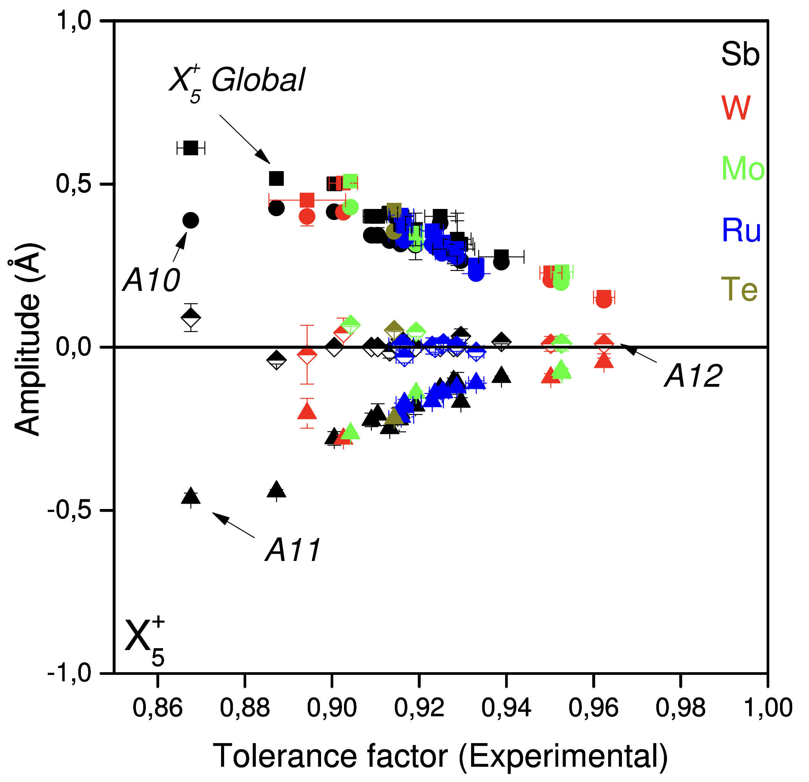
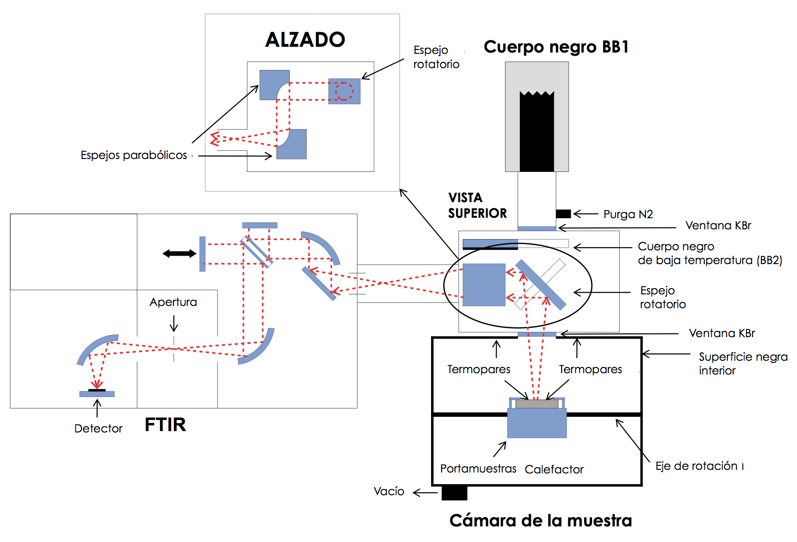
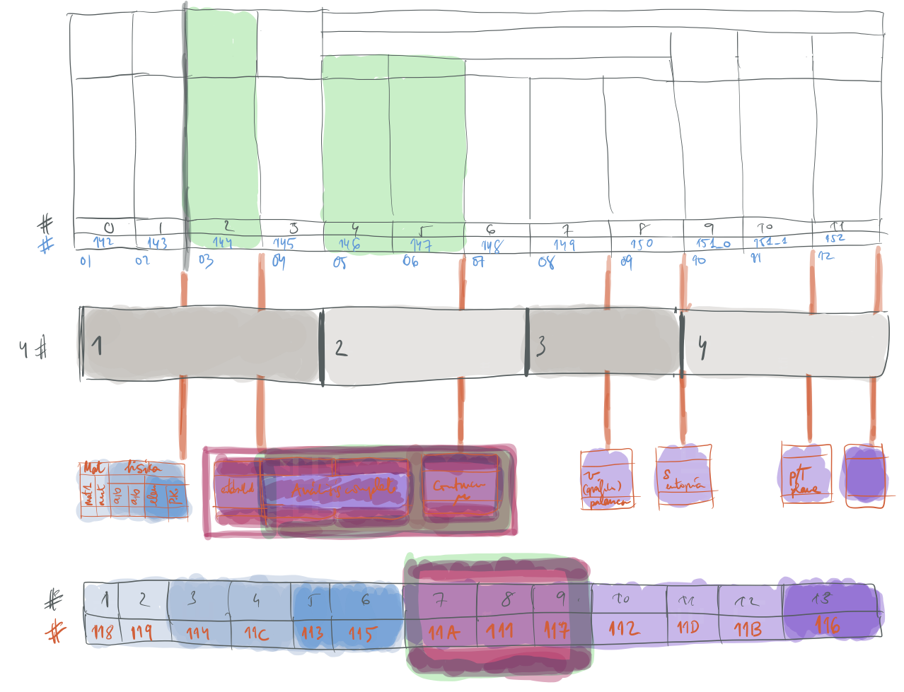

```{=html}
<div class="crumbs"><a href="../index.html">igartua</a> / ikerketa</div>
<article class="page-article">
<h1>Ikerketa</h1>
<p class="sub">Bi lerro materialen fisikan eta bat fisikako ikasgelan. Ohitura bera dute: datuek erabaki dezatela simetria, eta konputazioa erreproduzigarri mantendu.</p>
```

## Egitura eta fase-trantsizioak perobskitetan {#structure}

Nire doktorego-lana kristal ferroikoen eta antzekoen solido-solido fase-trantsizio estrukturalei buruzkoa izan zen, kalorimetria adiabatikoz eta bibrazio-espektroskopiaz aztertuak. Hortik lerroa perobskita motako oxidoetara hazi zen, ABO₃ sinpleak, A₂BB′O₆ bikoitzak eta hirukoitzak, beren egitura kubiko idealetik oktaedroen biraketen, katioi-ordenaren eta zentrotik kanpoko desplazamenduen bidez desitxuratzen direnak, eta zeinen propietate magnetiko, dielektriko eta garraiokoak distortsio horien mende dauden. Hogeita hamar urtez material horien egitura kristalinoak zehaztu ditut eta haien fase-trantsizioak tenperaturarekin jarraitu, laborategiko eta sinkrotroiko X izpien hauts-difrakzioz, neutroien difrakzioz, Raman eta infragorri espektroskopiaz eta kalorimetriaz, monokristaletan eta hautsetan. Institut Laue-Langevin, ESRF eta PSIko SINQ iturriko hemezortzi esperimentu lerro honetakoak dira, zuzendu ditudan bost doktorego-tesietatik laurekin batera.

Lana lotzen duen metodoa simetria-moduen analisia da, edo moduen kristalografia: egitura desitxuratu bat ez deskribatzea koordenatu atomikoen bidez, baizik eta fase amaren simetriara egokitutako moduen anplitudeen bidez, Bilbao Crystallographic Server-eko AMPLIMODESek inplementatzen duen moduan. Nire ekarpen propioa, K₀.₅Na₀.₅NbO₃ eta Sr₂MM′O₆ familietan garatua M′ = Sb, W, Mo, Ru, Te izanik, errefinamendu-protokolo parametrizatu bat da: familia bateko kide baten bereizmen handiko datuek modu-anplitudeen arteko erlazioak finkatzen dituzte, eta erlazio horiek laborategiko X izpien datuak, berez elementu arinak edo biraketa sotilak bereizten ez dituztenak, zentzu fisikoko soluzio bateraino errefinatzea ahalbidetzen dute. Bereizmen handiko esperimentu garestien beharra murrizten du eta aurretiazko datuak erabilgarri egiten ditu.

```{=html}
<figure class="thesis-figure"><figcaption>X₅⁺ moduaren eta bere osagaien anplitudea tolerantzia-faktore esperimentalarekiko Sr₂MM′O₆ perobskita bikoitzetarako, B′ katioiaren araberako koloreekin. Familien arteko erregulartasuna da errefinamendu parametrizatuak ustiatzen duena.</figcaption></figure>
```

## Materialen propietate erradiatibo termikoak {#radiation}

Azken hamarkadan nire jarduera energiarako materialen tenperatura altuko propietate termofisikoetara eta portaera erradiatibo infragorrira mugitu da, Thermomat taldean, UPV/EHUko materialen propietate termofisikoen ikerketa-taldean, nik ko-zuzentzen dudana. Taldeak HAIRL erabiltzen du, etxean eraikitako zehaztasun handiko erradiometro infragorria: emisibitate espektral norabidezkoa 0,83tik 25 μm-ra, giro-tenperaturatik 1000 °C-ra, atmosfera kontrolatuan, ziurgabetasun-aurrekontu osoarekin. Nire lan-zatia tresnan eta bere datuetan dago laginetan bezainbeste: emisometroaren eguneratzea, *IEEE Transactions on Control Systems Technology* aldizkarian argitaratutako eredurik gabeko kaskadako tenperatura-kontrola, *Metrologia* aldizkariko neurketa-metodo eguneratua eta ziurgabetasun-aurrekontua, emaitza esperimental trazagarrien FAIR erregistrorako «fer» esparrua *IEEE Transactions on Instrumentation and Measurement* aldizkarian, eta EKHI, *Scientific Data* aldizkarian deskribatutako eta emissivity.org-ek indexatutako solidoen propietate optiko eta erradiatibo termikoen datu-base irekia. Materialak oxidatzen ari diren altzairuetatik, entropia handiko aleazioetatik eta fusio nuklearrerako materialetatik laser bidez ereduztatutako gainazaletara eta kontzentrazio bidezko eguzki-energiarako estaldura selektiboetara doaz, CIC Energigune, Tecnalia, Petronor, ArcelorMittal eta ESS Bilbaorekin eta atzerriko bazkide akademikoekin lankidetza estuan.

```{=html}
<figure class="thesis-figure"><figcaption>HAIRLen antolaera optikoa: espektrometroak lagin-ganberaren eta bi gorputz beltz erreferentziaren artean txandakatzen du ispilu birakari baten bidez; lagina berogailu baten gainean dago hutsean edo purgan, biraketa-ardatz batean norabidezko neurketetarako.</figcaption></figure>
```

## Konputazioa fisikaren irakaskuntzan {#teaching}

Hirugarren lerroa termodinamika irakasteko modu gisa hasi zen eta ikerketa bihurtu zen. Euskaraz idatzitako Jupyter koadernoak irakasgai teoriko baten laborategi-koadernoa dira: ikasleek dokumentu berean deduzitzen, kalkulatzen eta irudikatzen dute, eta irakasgaiak egindakoaren eguneroko egunkaria darama. MinervaLab, lehen ordenako fase-trantsizioen eta van der Waals fluidoaren simulazio-laborategi interaktiboa, gradu amaierako lan gisa eraiki zen nire zuzendaritzapean, GPL lizentziapean argitaratu zen, eta CSEDU 2017, GIREP 2018 eta Real Sociedad Española de Física elkartearen 2019ko bilera bienalean aurkeztu ditudan fisikaren didaktikako ekarpenen oinarria da, baita UPV/EHUn zuzendu nuen laborategi-koaderno elektronikoari buruzko irakaskuntza-berrikuntzako proiektuarena ere. Tresna berberek beste galdera bati erantzuten diote orain: zer dioten datuek ikasleek nola errenditzen duten, irakasgaiaren beraren erregistroetatik fisikako sarbide-azterketara Espainiako erkidegoetan.

```{=html}
<figure class="thesis-figure"><figcaption>MinervaLab-en plangintza-zirriborroa: simulazio-aplikazioen deskonposizioa, bakoitza bere kodearekin, lerro bat idatzi aurretik marraztua. Softwarea GitHuben dago, jongablop/MinervaLab helbidean.</figcaption></figure>
```

## Proiektuak eta kontratuak

Berrogei ikerketa-proiektu lehiakor, ikerketa-talde aitortu eta ekintza finantzatu baino gehiago ibilbidean zehar, gutxienez zortzi ikertzaile nagusi edo ko-nagusi gisa, Europako instalazio handietako esperimentuak barne. Azkenak, guztiak Thermomat taldean:

```{=html}
<table>
<thead><tr><th>Urteak</th><th>Proiektua</th><th>Finantzatzailea</th></tr></thead>
<tbody>
<tr><td>2025–2026</td><td>SIMULATE: eskala anitzeko eta fisika anitzeko simulazio-hurbilketak laser bidezko mikrofabrikazioan (KK-2025/00075)</td><td>Eusko Jaurlaritza, 135 284 €</td></tr>
<tr><td>2024–2026</td><td>Altzairuen ekoizpeneko akatsen azterketa sistematikoa trazagarritasunerako eta eraginkortasunerako (US24/04), Sidenor I+D-rekin</td><td>UPV/EHU, 14 585 €</td></tr>
<tr><td>2021–2025</td><td>Materialen propietate termofisikoen ikerketa-taldea (IT1714-22)</td><td>Eusko Jaurlaritza, 104 400 €</td></tr>
<tr><td>2021–2023</td><td>Azken belaunaldiko aleazio aeronautikoen karakterizazioa tenperatura altuetarako (PIBA_2021_1_0022)</td><td>Eusko Jaurlaritza, 50 000 €</td></tr>
<tr><td>2019–2022</td><td>Materialen propietate termofisikoen ikerketa-taldea (GIU19/019, IT1364-19)</td><td>UPV/EHU eta Eusko Jaurlaritza, 26 271 €</td></tr>
<tr><td>2019–2021</td><td>Termografiako zuzenketa-algoritmoen garapenerako modelizazioa (US19/13), Petronorrekin</td><td>UPV/EHU, 63 450 €</td></tr>
<tr><td>2018–2019</td><td>Sistema hibridoetarako energia elektrokimikoaren eta termikoaren biltegiratzeari buruzko oinarrizko ikerketa estrategikoa (ELKARTEK KK-2018/00098), CIC Energigunek koordinatua</td><td>Eusko Jaurlaritza, 74 018 € taldearentzat, 3,1 M€ guztira</td></tr>
</tbody>
</table>
<p style="margin-top:22px">Enpresekiko kontratuak: materialen propietate termo-optikoak ITP Aerorentzat (2025); hodi-azalaren tenperatura neurtzeko teknika termo-optikoak Petronorren labeetan (2019–2021); 316L altzairuaren emisibitate infragorria gainazal-akabera desberdinekin ESS Bilbaorentzat (2017).</p>
```

```{=html}
</article>
```
